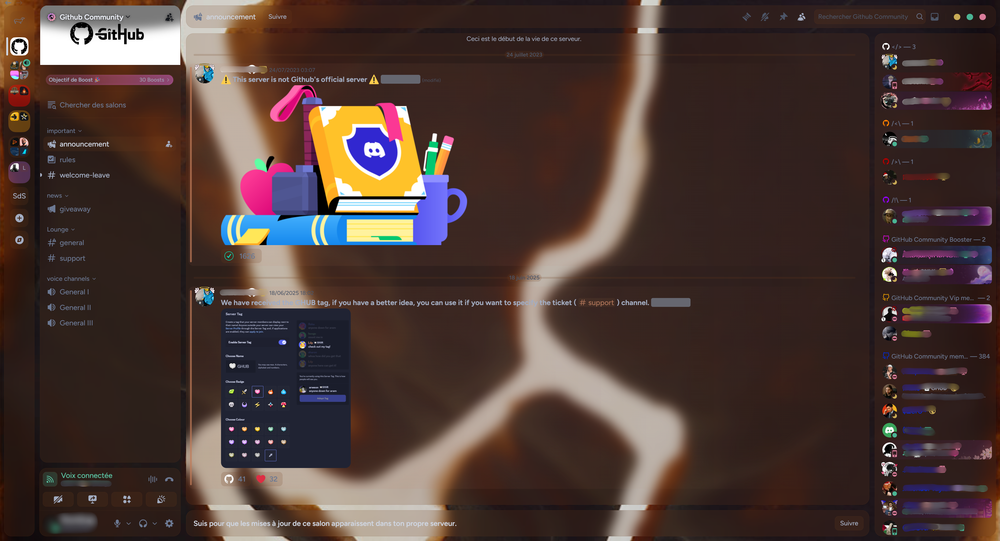

# 🎨 Stroubi Theme

Stroubi Theme est un thème Discord personnalisé basé sur le thème **Midnight Discord** de refact0r.  
Il propose une interface élégante, chaleureuse et moderne, dominée par des tons bruns, avec un fond personnalisé, du flou, de la transparence et de nombreuses options de configuration.

## ✨ Fonctionnalités

- 🎨 Palette de couleurs personnalisée (tons bruns chaleureux)
- 🖼️ Image de fond personnalisée
- 🌫️ Effets de transparence et de flou
- 🐶 Icône DM personnalisée (SVG)
- ⚙️ Nombreuses options CSS (animations, tailles, chatbar, top bar, etc.)
- 🧩 Basé sur **Midnight Discord** (stable et maintenu)

## 📦 Prérequis

- Discord (version bureau)
- Un injecteur de thème :
  - **BetterDiscord**
  - **Vencord**
  - ou tout autre client compatible CSS

## 🚀 Installation

1. Télécharge le fichier `Stroubi.theme.css`
2. Place-le dans le dossier des thèmes de ton client Discord  
   - BetterDiscord :  
     ```
     %appdata%/BetterDiscord/themes
     ```
3. Active le thème dans les paramètres Discord

## 🛠️ Personnalisation

Tu peux facilement modifier le thème directement dans le fichier CSS :

- Police (`--font`)
- Image de fond (`--background-image-url`)
- Intensité du flou (`--blur-amount`)
- Couleurs principales (`--brown-*`, `--accent-*`)
- Animations et transitions

Toutes les options sont clairement commentées dans le fichier.

## 📸 Aperçu



## 🙏 Crédits

- Thème original : **Midnight Discord** par [refact0r](https://github.com/refact0r)
- Personnalisation : **Sourdoug**

## 📄 Licence

Ce projet est distribué à des fins personnelles et de personnalisation.  
Merci de créditer l’auteur original en cas de modification ou redistribution.

---

✨ Amuse-toi bien avec Stroubi Theme !
